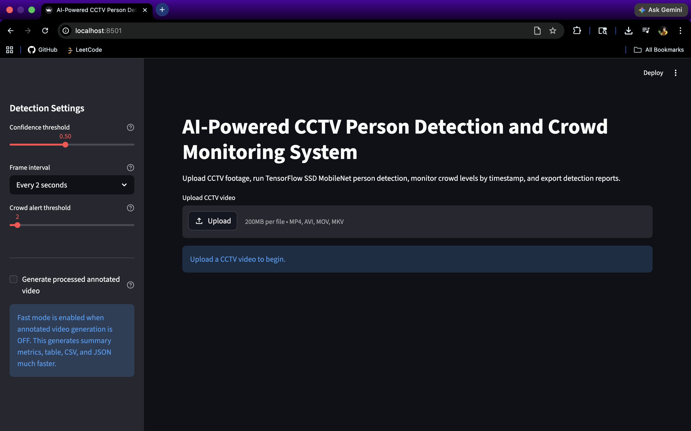
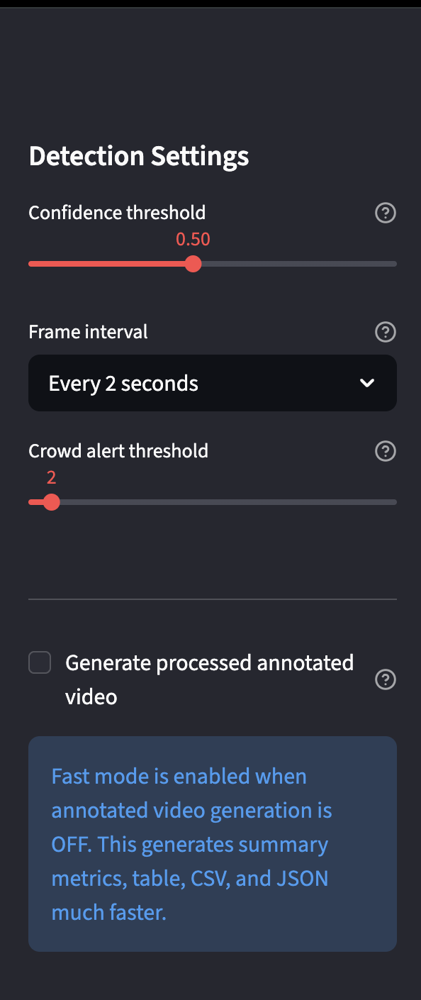
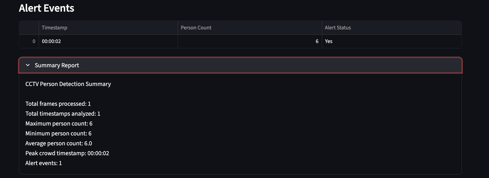
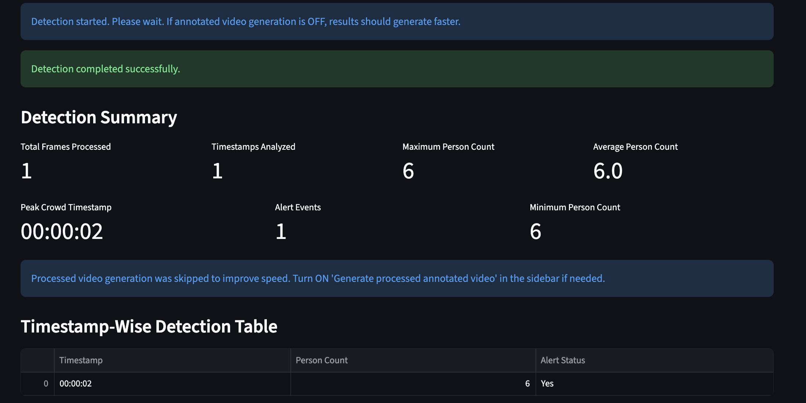
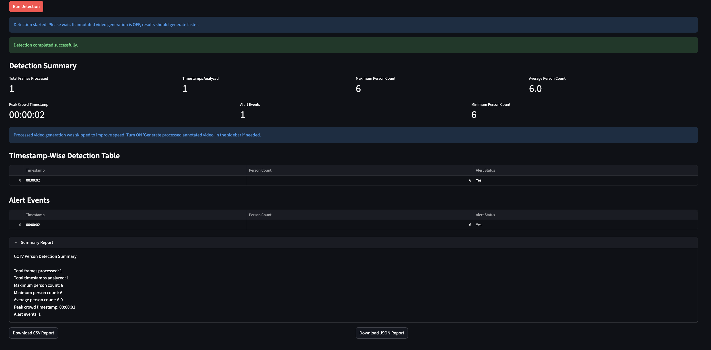

# AI-Powered CCTV Person Detection and Crowd Monitoring System


## Project Overview

A professional computer vision application that detects people in CCTV videos, measures timestamp-wise crowd count, flags crowd alerts, and exports analytics reports using TensorFlow, OpenCV, and Streamlit.

---

## Problem Statement

CCTV footage often requires manual review to understand crowd presence, people movement, and crowd density at different timestamps. Manual monitoring is time-consuming, inconsistent, and difficult to scale.

This project automates CCTV person detection by sampling video frames, detecting people, counting persons at each timestamp, and generating simple crowd-monitoring analytics.

---

## Features

- Upload CCTV video files through a Streamlit interface
- Preview the uploaded video before processing
- Configure confidence threshold for person detection
- Analyze video frames every 1, 2, or 5 seconds
- Set a crowd alert threshold
- Count only detections classified as `person`
- Display detection summary metrics
- Show timestamp-wise detection results in a table
- Highlight crowd alert events
- Export CSV and JSON reports
- Optional processed annotated video generation
- Fast mode for quicker analysis when annotated video generation is disabled

---

## Tech Stack

| Category | Technology |
|---|---|
| Programming Language | Python |
| Computer Vision | OpenCV |
| Object Detection | TensorFlow SSD MobileNet Frozen Graph |
| UI Framework | Streamlit |
| Data Handling | Pandas, NumPy |
| Reporting | CSV, JSON |
| Model Compatibility | TensorFlow 2 compatibility wrappers |

---

## Recommended Python Version

This project is tested with:

```text
Python 3.11
```

TensorFlow may not install correctly on newer Python versions such as Python 3.14.  
For best compatibility, use Python 3.11 in a virtual environment.

---

## Key ML Concepts Demonstrated

- Object detection using a pre-trained TensorFlow SSD MobileNet model
- CCTV video frame processing using OpenCV
- Frame sampling for efficient video analysis
- Confidence thresholding for filtering weak detections
- Person-count analytics from detection outputs
- Rule-based crowd alert generation
- TensorFlow 1.x frozen graph compatibility inside TensorFlow 2.x
- Streamlit-based ML application deployment structure
- CSV and JSON report generation for inference results

---

## Architecture / Workflow

```text
Video Upload
    |
Save uploaded video locally
    |
Open video using OpenCV
    |
Sample frames every N seconds
    |
Run TensorFlow SSD MobileNet inference
    |
Filter detections by confidence score and person class
    |
Calculate person count
    |
Generate alert status based on threshold
    |
Display summary metrics, table, alerts, and reports in Streamlit
```

---

## Project Structure

```text
cctv-person-detection-system/
│
├── app.py
├── detection.py
├── utils/
│   ├── video_utils.py
│   ├── report_utils.py
│   ├── label_map_util.py
│   ├── people_class_util.py
│   └── visualization_utils.py
│
├── models/
│   └── README.md
│
├── sample_videos/
│   └── README.md
│
├── outputs/
│   └── .gitkeep
│
├── images/
│   ├── Home-page.png
│   ├── Filters.png
│   ├── Video-Summary.png
│   ├── Detection-Summary.png
│   └── Overview.png
│
├── requirements.txt
├── README.md
├── .gitignore
└── LICENSE
```

---

## Installation

Create and activate a virtual environment:

```bash
python3.11 -m venv .venv
source .venv/bin/activate
```

Install dependencies:

```bash
pip install -r requirements.txt
```

If TensorFlow protobuf compatibility issues appear, run:

```bash
export PROTOCOL_BUFFERS_PYTHON_IMPLEMENTATION=python
```

---

## Model Setup

Large model files are intentionally not committed to GitHub.

Place the SSD MobileNet frozen graph at:

```text
models/ssd_mobilenet_v1_coco_2018_01_28/frozen_inference_graph.pb
```

If the model is stored elsewhere, set:

```bash
export CCTV_MODEL_PATH="/absolute/path/to/frozen_inference_graph.pb"
```

> Note: The TensorFlow frozen graph model file is not included in this repository because it is large. Download or copy the model file manually before running the app.

---

## How To Run

Start the Streamlit app:

```bash
export PROTOCOL_BUFFERS_PYTHON_IMPLEMENTATION=python
streamlit run app.py
```

Then:

1. Upload a CCTV video.
2. Select confidence threshold, frame interval, and alert threshold.
3. Keep `Generate processed annotated video` turned OFF for faster processing.
4. Click `Run Detection`.
5. Review summary metrics, timestamp-wise results, alert rows, and exported reports.

---

## How Detection Works

The project uses the original TensorFlow Object Detection frozen graph approach with TensorFlow 2 compatibility wrappers:

- `tf.compat.v1.disable_eager_execution()`
- `tf.compat.v1.GraphDef()`
- `tf.compat.v1.import_graph_def()`
- `tf.compat.v1.Session()`
- `tf.io.gfile.GFile()`

OpenCV reads the uploaded CCTV video. Instead of running inference on every frame, the application samples frames at the selected interval, such as every 2 seconds or 5 seconds.

Each sampled frame is passed to the TensorFlow model. Detections are counted only when:

- The detected class is `person`
- The confidence score is greater than or equal to the selected threshold

Alert status is generated using:

```text
Alert = Yes if person_count >= alert_threshold
Alert = No otherwise
```

---

## Sample Output Table

| Timestamp | Person Count | Alert Status |
|---|---:|---|
| 00:00:02 | 6 | Yes |
| 00:00:05 | 3 | Yes |
| 00:00:10 | 1 | No |

---

## Screenshots

### Home Page

<p align="center">
  
</p>

---

### Detection Settings / Filters

<p align="center">
  
</p>

---

### Video Preview and Detection Status

<p align="center">
  
</p>

---

### Detection Summary

<p align="center">
  
</p>

---

### Alert Events and Summary Report

<p align="center">
  
</p>

---

## Privacy Note

Do not upload real CCTV footage, private surveillance videos, or sensitive personal footage to GitHub.

Uploaded videos are processed locally during runtime and outputs are saved under the ignored `outputs/` folder. This project is intended for demonstration, learning, and portfolio purposes. It is not designed as a production-grade surveillance system.

---

## Limitations

- Accuracy depends on the SSD MobileNet model, camera angle, lighting, and video quality.
- The app samples frames at fixed time intervals, so fast events between sampled frames may be missed.
- The model detects visible people only and may struggle with occlusion, blur, low resolution, or crowded scenes.
- The application is designed for local demonstration, not real-time multi-camera deployment.
- The current model is older compared to modern YOLO-based object detection systems.

---

## Future Improvements

- Add optional YOLO-based inference as a modern backend.
- Add charts for crowd count over time.
- Add heatmap-style scene analytics.
- Add multi-video batch processing.
- Add Docker support for reproducible setup.
- Add real-time webcam/CCTV stream support.
- Improve output video annotation continuity between sampled frames.
- Add model selection between TensorFlow SSD MobileNet and YOLO.

---

## 👨‍💻 Author

**Harshith**

---

## 📌 Project Status

Completed basic working version with Streamlit UI, TensorFlow SSD MobileNet person detection, OpenCV video processing, timestamp-wise crowd monitoring, alert event detection, and CSV/JSON report export.

